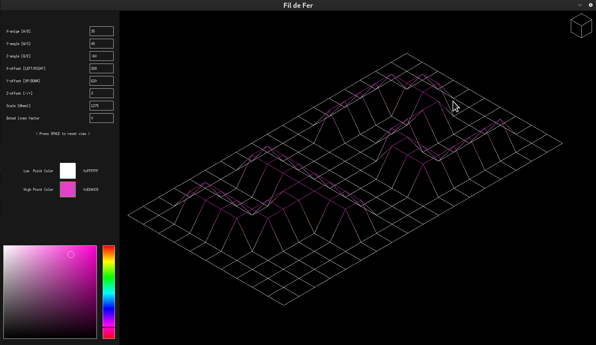
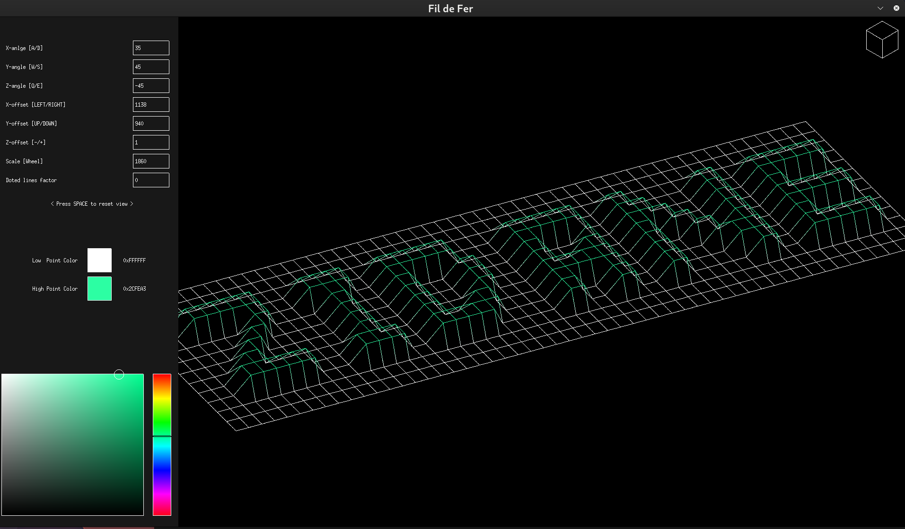
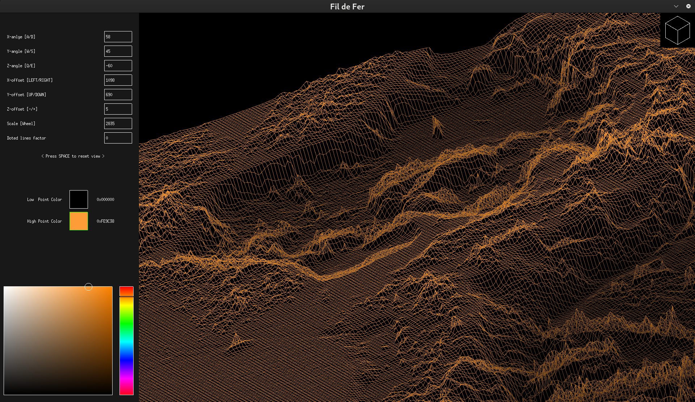
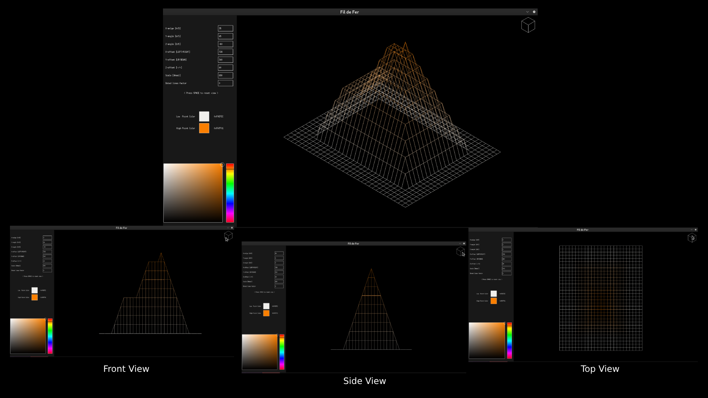

# FDF Project

**Description:**

The **FDF (File Data Format)** project is a C implementation that uses the 42 MLX library to render a wireframe of a 3D object from a `.fdf` file. The project involves reading the data from the `.fdf` file, parsing the coordinates, and then drawing a wireframe of the object in 2D space using the graphical capabilities of the MLX library.

The core functionality includes:
- Reading and parsing `.fdf` files.
- Mapping the 3D coordinates into a 2D plane.
- Drawing the wireframe using lines to represent the 3D object.
- Implementing zoom, rotation, and translation of the object.

This project is a part of the 42 school curriculum, and is meant to improve knowledge of 3D projections, graphics programming, and low-level graphics libraries.

---

## Features

- **Wireframe Rendering:** Render 3D objects as wireframes based on `.fdf` file data.
- **Zooming:** Ability to zoom in and out on the object.
- **Rotation:** Rotate the object along the X, Y, or Z axis.
- **Translation:** Move the object in 2D space.
- **Interactive:** Use keyboard and mouse input to manipulate the object.

---

## Installation

### Prerequisites

Ensure you have the following installed:
- A **C compiler** (such as `gcc`)
- **42's MLX** library for graphics rendering (Make sure to follow the installation instructions on their repository)


  1. Navigate to the `mlx_linux` folder:
  
     ```bash
     cd mlx_linux
     ```

  2. Run the configuration script:
  
     ```bash
     ./configure
     ```

  3. After running the configuration, you should be able to compile and use the MLX library in your project.

### Steps

1. Clone the repository:

   ```bash
   git clone https://github.com/ismailnajah/fdf.git
   cd fdf
   ```

2. Compile the program:

   ```bash
   make
   ```

3. Run the program:

   ```bash
   ./fdf path_to_your_file.fdf
   ```

   Replace `path_to_your_file.fdf` with the location of your `.fdf` file.

---

## Usage

To interact with the wireframe, you can use the following keyboard controls:

- **Arrow Keys:** Move the view.
- **Scroll Wheel:** Zoom in / zoom out.
- **W/S**: Rotate along X axis.
- **A/D**: Rotate along Y axis.
- **Q/E**: Rotate along Z axis.
- **+/-**: Increase/decrease Z-Height.
- **ESC:** Exit the program.

---

## Screenshots


*42.fdf Map.*


*zidan.fdf Map.*


*Japan.L.fdf Map.*

Parallel view examples using pyramide.fdf map

*parallel views of pyramide.fdf Map.*

---

## Acknowledgments

- The **42 School** for providing the basis for this project.
- The **MLX** library for making 2D graphics rendering in C accessible.

